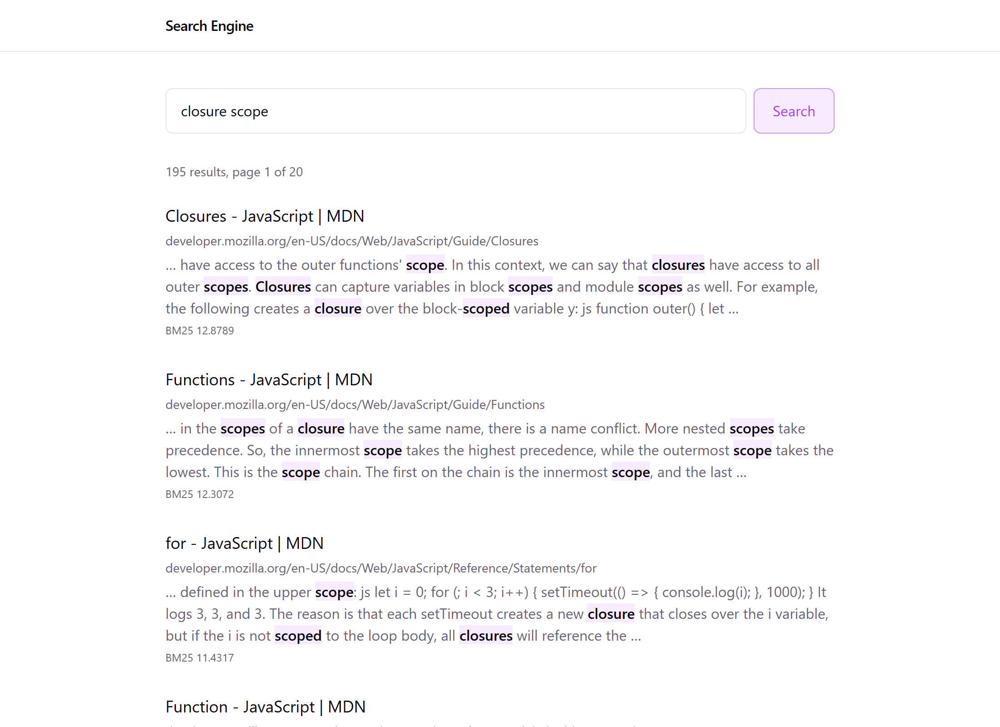
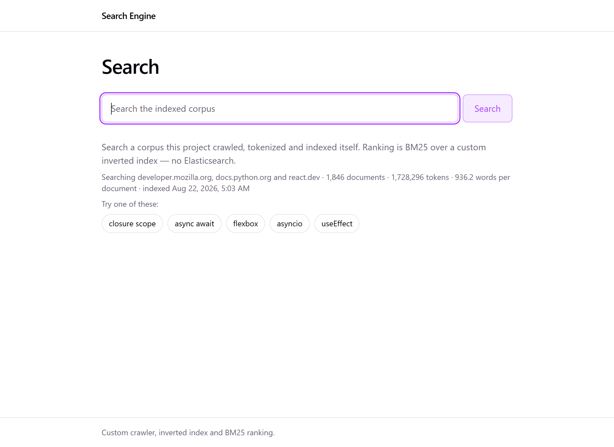
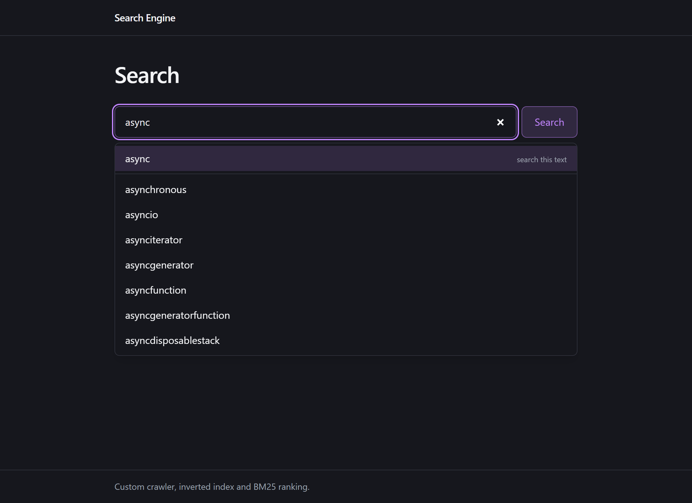

# Search Engine

A working search engine built from scratch in TypeScript — crawler, text pipeline, inverted
index and BM25 ranking, all hand-written. No Elasticsearch, no Lucene, no search libraries of
any kind.

It currently indexes **1,846 pages** of developer documentation from MDN, the Python standard
library and react.dev: **26,478 terms**, **441,647 postings**, answering queries in **12–16 ms**.



Search `closure scope` and the top result is MDN's *Closures* guide. Nothing about that is
configured — the ranker weighed `closur` (appearing in 25 documents) against `scope` (87),
scored every candidate, and put the right page first. The highlighting is the stem `closur`
resolved back to the exact characters of `closures` and `closed` in the source text.

---

## What it does

**Crawls.** A polite concurrent crawler with `robots.txt` compliance, per-host rate limiting,
a Redis-backed frontier, URL canonicalisation, redirect handling, charset detection and
content-hash deduplication.

**Processes.** HTML → clean text via Cheerio, then Unicode normalisation, tokenisation with
character offsets, stopword removal and Porter stemming — one pipeline, used identically at
index time and query time.

**Indexes.** A hand-built inverted index: `term → [{docId, termFrequency, positions}]`, with
corpus-global document frequencies, written to Postgres in one transaction via `COPY`.

**Ranks.** BM25, implemented from the formula — IDF, term-frequency saturation (`k1`), document
length normalisation (`b`), multi-term aggregation.

**Serves.** A REST API with snippet extraction, match highlighting, prefix autocomplete, an
LRU result cache, zod validation and rate limiting — behind a React + Tailwind front end with a
keyboard-accessible combobox.

<table>
<tr>
<td width="50%"></td>
<td width="50%"></td>
</tr>
<tr>
<td>The empty state names what is in the corpus and offers a way in.</td>
<td>Autocomplete over 26,478 terms, in-process, no network hop.</td>
</tr>
</table>

---

## How it works

```
seed URLs
   │
   ▼
┌──────────┐  robots.txt · per-host delay · dedup   ┌───────────────┐
│ Crawler  │ ────────────────────────────────────▶ │  Postgres     │
│  Redis   │       title + extracted text          │  documents    │
│ frontier │                                       └───────────────┘
└──────────┘                                               │
                                                           ▼
                                            ┌──────────────────────────┐
                                            │ normalise → tokenise →   │
                                            │ stopwords → Porter stem  │
                                            │        ↓                 │
                                            │   inverted index         │
                                            └──────────────────────────┘
                                                           │
                                          terms · postings · corpus stats
                                                           ▼
   query ──▶ ┌────────────┐   posting lists   ┌─────────────┐   top-k
             │  Search    │ ────────────────▶ │    BM25     │ ────────┐
             │  service   │ ◀──────────────── │   ranker    │         │
             └────────────┘                   └─────────────┘         ▼
                │   │  │                                       snippets +
                │   │  └── autocomplete (in-memory) ──┐        match offsets
                │   └────── result cache (LRU + TTL) ─┤              │
                ▼                                      │              ▼
        React + TypeScript + Tailwind ◀───────────────┴────────  JSON API
```

**A search request, end to end:**

`GET /api/search?q=` → zod validation → normalise the query through *the same pipeline used at
index time* → cache lookup keyed on the stems → on a miss, fetch posting lists from Postgres →
BM25 score, sort, paginate → select the best snippet window and compute match offsets → cache →
respond.

The crawl and index are offline jobs (`npm run crawl`, `npm run index`). The API only reads.

---

## Running it

**Requirements:** Node 22+, Docker.

```bash
git clone <this repo> && cd Search_Engine2
npm install
cp server/.env.example server/.env

docker compose up -d      # Postgres 17 + Redis 8
npm run migrate           # create the schema
```

Then populate it. Either crawl a real site:

```bash
npm run crawl -- --seed https://developer.mozilla.org/en-US/docs/Web/JavaScript --max 480 --depth 1
npm run index
```

…or load the bundled fixture corpus for an instant start:

```bash
npm run seed              # 3 documents, index included — no crawl needed
```

Run it:

```bash
npm run dev:server        # API on :4000
npm run dev:client        # UI on :5173
```

### Commands

| Command | What it does |
|---|---|
| `npm run crawl -- --seed <url> [--max n] [--depth n] [--fresh]` | Crawl into `documents` |
| `npm run index [-- --dry-run]` | Rebuild the inverted index |
| `npm run search -- "<query>" [--explain]` | Search from the terminal |
| `npm run dev:server` / `dev:client` | Development servers |
| `npm test` | 535 tests |
| `npm run build` | Production build |

`--explain` prints each query term's stem, document frequency, IDF and match count — useful for
seeing *why* something ranked where it did.

> **Windows:** run the CLI from Git Bash. PowerShell strips the `--` separator, so npm swallows
> the flags as its own configuration.

> **Re-crawling:** pass `--fresh` on every crawl after the first. The frontier persists in Redis
> between runs, so a second crawl with a different seed would otherwise inherit the previous
> one's leftover queue. And run `npm run index` after any crawl — a crawl writes documents, not
> the index.

### Endpoints

| | |
|---|---|
| `GET /api/search?q=&page=&pageSize=` | Ranked results with snippets and match offsets |
| `GET /api/suggestions?q=` | Autocomplete for a prefix |
| `GET /api/statistics` | Corpus size, sources, last index time |
| `GET /api/health` | Liveness plus dependency checks |

---

## Project layout

An npm-workspaces monorepo. Every module takes its database client as an argument rather than
importing one, so exactly one entry point per phase opens connections.

```
shared/src/           types + constants shared by server and client
server/src/
  crawler/            fetcher · robots · parser · url · frontier · scheduler · store · cli
  processing/         normalizer · tokenizer · stopwords · stemmer · pipeline
  indexer/            postings · invertedIndex · indexStore · cli
  ranking/            bm25 · scorer · searchStore · cli
  search/             queryProcessor · snippets · autocomplete · cache · corpusVersion
  api/                server · routes · middleware
  db/                 pg · redis
server/db/            migrations · schema.sql · seed.sql
client/src/           components · hooks · pages · services · lib
```

**Stack.** TypeScript (ESM) · Express · Postgres 17 (`pg`, raw SQL) · Redis (`ioredis`,
crawl only) · Cheerio · zod · React 19 · Tailwind v4 · TanStack Query · Headless UI · Vitest.

The only algorithmic dependency is `stemmer` (Porter). Everything else is transport, storage or
UI.

---

## Testing

```bash
npm test
```

535 tests across 33 files. The design keeps them cheap: the ranker, tokenizer, snippet builder
and cache are pure functions, so most tests need no infrastructure at all.

Where a test *does* need infrastructure, it uses the real thing rather than a mock — the crawler
runs against a real `node:http` fixture server, and the SQL runs against a real migrated
Postgres. A mocked database can only assert your own assumptions back at you, and the bugs worth
catching here are in the SQL.

Integration tests use a separate `search_engine_test` database, auto-created and migrated;
`globalSetup` refuses to run against any database whose name does not end in `_test`.

---

## What is deliberately not here

- **Phrase queries.** `postings.positions` is stored and ready; nothing reads it yet.
- **Field weighting (BM25F).** Titles are indexed but not boosted. The unrecoverable failure —
  a term appearing only in a title making a page unmatchable — is already solved by indexing
  titles at all. Real field weighting is a schema change, and no evidence has asked for it.
- **Incremental reindexing.** Declined, not deferred: it is a performance fix for a problem this
  corpus size does not have, and a second index-writing path with no authority to say which of
  the two is wrong.
- **Path-scoped crawling.** Crawl scope is a host allowlist. A `--path-prefix` flag is the
  obvious next step for indexing one section of a large site.
- **Non-English support.** The stopword list is English and the stemmer is Porter. CJK text
  tokenises as one run per unspaced sequence — a documented non-goal that needs a
  dictionary-based segmenter.

---

## Why this exists

To understand search engines by building one, rather than by configuring one. Every component
that makes it a search engine — the crawl frontier, the tokenizer, the inverted index, the
ranking function, the snippet extractor — is written out rather than imported.
